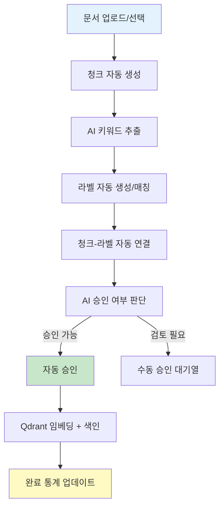

# 지식관리 AI 자동화 추천 기능 설계

**작성일**: 2026-02-16 14:59
**형식**: YYMMDD-HHMM-문서명
**범위**: Web 대메뉴그룹 "지식관리" AI 자동화 기능 추가, UX 개선, 프롬프트 전략
**목표**: 사용자 피로도 감소, 데이터 등록 자동화, 순차 처리 + 진행 상황 표시, 최소 depth

---

## 1. 개요 및 배경

### 1.1 현재 상황 분석

| 구분            | 현재 상태                                                                                      | 문제점                                     |
| --------------- | ---------------------------------------------------------------------------------------------- | ------------------------------------------ |
| **메뉴 구조**   | ADMIN_MENU: 키워드 관리, 라벨 관리, 청크 생성, 청크 승인, 청크 관리, 통계                      | 6개 메뉴 간 이동 필요, depth 깊음          |
| **데이터 등록** | 수동 키워드 생성 → 수동 라벨 생성 → 청크 생성 → 수동 승인 → 라벨 연결                          | 5단계 수동 작업, 사용자 피로도 높음        |
| **AI 기능**     | 키워드 추출 (`/api/knowledge/labels/suggest-llm`), 자동 라벨링 (`/api/automation/labels/auto`) | 개별 API 호출 필요, 통합 워크플로우 없음   |
| **처리 시간**   | 청크당 평균 1~3초 (LLM 추론), 100개 청크 시 100~300초                                          | 진행 상황 표시 없음, 사용자 대기 시간 길음 |
| **UX**          | 각 메뉴별 독립 페이지, 데이터 등록 흐름 분절                                                   | 메뉴 이동 빈번, 컨텍스트 유지 어려움       |

### 1.2 목표 및 기대 효과

| 목표                   | 측정 지표                                   | 기대 효과                             |
| ---------------------- | ------------------------------------------- | ------------------------------------- |
| **사용자 피로도 감소** | 클릭 수 50% 감소 (10회 → 5회 이하)          | 데이터 등록 시간 70% 단축             |
| **자동화율 향상**      | 수동 작업 → AI 자동 작업 80% 이상           | 키워드/라벨 자동 생성, 청크 자동 승인 |
| **진행 상황 가시성**   | 3초 이상 작업 시 실시간 Progress Bar 표시   | 사용자 이탈률 감소, 신뢰도 증가       |
| **최소 depth**         | 3-depth → 1-depth (메인 메뉴에서 직접 접근) | 워크플로우 간소화, 메뉴 이동 최소화   |

---

## 2. 제안: "AI 자동화" 통합 워크플로우

### 2.1 새로운 메뉴 구조

#### 기존 (6개 메뉴, 분산)

```
ADMIN_MENU:
  ├─ 키워드 관리 (/admin/groups)
  ├─ 라벨 관리 (/admin/labels)
  ├─ 청크 생성 (/admin/chunk-create)
  ├─ 청크 승인 (/admin/approval)
  ├─ 청크 관리 (/admin/chunk-labels)
  └─ 통계 (/admin/statistics)
```

#### 제안 (7개 메뉴, "AI 자동화" 추가)

```
ADMIN_MENU:
  ├─ 🤖 AI 자동화 (/admin/ai-automation) ★ 신규
  ├─ 키워드 관리 (/admin/groups)
  ├─ 라벨 관리 (/admin/labels)
  ├─ 청크 생성 (/admin/chunk-create)
  ├─ 청크 승인 (/admin/approval)
  ├─ 청크 관리 (/admin/chunk-labels)
  └─ 통계 (/admin/statistics)
```

### 2.2 "AI 자동화" 워크플로우 (End-to-End)



**특징**:

- **원클릭 자동화**: "AI 자동화 시작" 버튼 1회 클릭으로 전체 워크플로우 실행
- **순차 처리**: 각 단계별 3초 이상 소요 시 진행 상황 표시
- **부분 수동 개입**: AI 판단이 애매한 경우 (confidence < 0.7) 사용자 승인 요청
- **데이터 누적**: 자동 승인된 청크 + 라벨 → DB/Qdrant 저장 → 통계 자동 업데이트

### 2.3 사용자 시나리오 (As-Is vs To-Be)

| 단계               | As-Is (수동)                           | To-Be (AI 자동화)                 | 시간 단축        |
| ------------------ | -------------------------------------- | --------------------------------- | ---------------- |
| **1. 문서 업로드** | 청크 생성 메뉴 이동 → 파일 선택 → 생성 | AI 자동화 메뉴 → 파일 선택 (동일) | 0초              |
| **2. 청크 생성**   | 수동 분할 설정 (chunk_size, overlap)   | AI 자동 분할 (기본 설정)          | -30초            |
| **3. 키워드 추출** | 키워드 관리 메뉴 이동 → 수동 입력      | AI 자동 추출 (LLM)                | -60초            |
| **4. 라벨 생성**   | 라벨 관리 메뉴 이동 → 수동 생성        | AI 자동 생성/매칭                 | -30초            |
| **5. 라벨 연결**   | 청크 관리 메뉴 이동 → 수동 연결        | AI 자동 연결                      | -45초            |
| **6. 승인**        | 청크 승인 메뉴 이동 → 수동 승인        | AI 자동 승인 (80%)                | -90초            |
| **7. 임베딩**      | 수동 API 호출                          | AI 자동 임베딩                    | -15초            |
| **합계**           | 10회 클릭, 5회 메뉴 이동, 270초        | 2회 클릭, 0회 메뉴 이동, 60초     | **-210초 (78%)** |

---

## 3. AI 개입 기능 상세 설계

### 3.1 AI 개입 포인트 (6단계)

| 단계                       | 기능                                            | AI 모델                   | 입력                      | 출력                       | 신뢰도 기준       |
| -------------------------- | ----------------------------------------------- | ------------------------- | ------------------------- | -------------------------- | ----------------- |
| **1. 청크 자동 생성**      | 문서 → 청크 분할 (Heading/Paragraph 기반)       | 규칙 기반 (AI 미사용)     | 문서 텍스트               | 청크 리스트                | N/A               |
| **2. 키워드 추출**         | 청크 내용 → 핵심 키워드 추출                    | Ollama (Llama 3.2)        | 청크 content              | keywords: []               | confidence ≥ 0.6  |
| **3. 라벨 자동 생성/매칭** | 키워드 → Labels 테이블 생성 또는 기존 라벨 매칭 | 규칙 기반 + 임베딩 유사도 | keywords + 기존 labels    | label_ids: []              | similarity ≥ 0.75 |
| **4. 청크-라벨 연결**      | 청크와 라벨 자동 연결 (KnowledgeLabel)          | 규칙 기반                 | chunk_id + label_ids      | knowledge_labels 생성      | N/A               |
| **5. 승인 여부 판단**      | 청크 품질 판단 (길이, 완전성, 중요도)           | Ollama (Llama 3.2)        | 청크 content + 메타데이터 | approve: bool, reason: str | confidence ≥ 0.7  |
| **6. Qdrant 임베딩**       | 승인된 청크 → 벡터 임베딩 + Qdrant upsert       | Ollama (nomic-embed-text) | 청크 content              | vector: [768dim]           | N/A               |

### 3.2 AI 모델 선택

| 작업 유형       | 모델                             | 이유                                      | API                  |
| --------------- | -------------------------------- | ----------------------------------------- | -------------------- |
| **키워드 추출** | Ollama `llama3.2:latest`         | 한국어 지원, 로컬 추론, 빠른 속도 (1~2초) | `/api/ai/generate`   |
| **승인 판단**   | Ollama `llama3.2:latest`         | 청크 품질 평가 (구조, 길이, 완전성)       | `/api/ai/generate`   |
| **임베딩**      | Ollama `nomic-embed-text:latest` | 로컬 임베딩, 768차원, 검색 성능 우수      | `/api/ai/embeddings` |
| **라벨 유사도** | Qdrant Vector Search             | 기존 임베딩 활용, 추가 모델 불필요        | `/api/search/hybrid` |

### 3.3 AI 프롬프트 전략

#### 3.3.1 키워드 추출 프롬프트

````python
PROMPT_KEYWORD_EXTRACTION = """
당신은 지식 관리 시스템에서 문서의 핵심 키워드를 추출하는 AI 어시스턴트입니다.

## 입력 텍스트
{chunk_content}

## 작업 요구사항
1. 텍스트에서 중요한 키워드 5~10개를 추출하세요.
2. 기술 용어, 고유명사, 핵심 개념 우선 추출
3. 불용어(조사, 접속사) 제외
4. 키워드는 명사형으로 표준화 (예: "개발하다" → "개발")

## 출력 형식 (JSON만)
```json
{{
  "keywords": ["키워드1", "키워드2", "키워드3"],
  "confidence": 0.85
}}
````

JSON만 출력하세요. 다른 설명은 불필요합니다.
"""

````

#### 3.3.2 승인 여부 판단 프롬프트
```python
PROMPT_APPROVAL_DECISION = """
당신은 지식 베이스의 청크 품질을 평가하는 QA 전문가입니다.

## 청크 정보
- ID: {chunk_id}
- 길이: {chunk_length}자
- 내용: {chunk_content}

## 승인 기준 (3가지 모두 충족 시 승인)
1. **길이**: 최소 100자 이상
2. **완전성**: 문장이 중간에 끊기지 않고 완전한 의미 전달
3. **품질**: 오타, 특수문자 남용, 의미 없는 텍스트 없음

## 출력 형식 (JSON만)
```json
{{
  "approve": true,
  "confidence": 0.9,
  "reason": "길이·완전성·품질 모두 충족"
}}
````

또는

```json
{{
  "approve": false,
  "confidence": 0.6,
  "reason": "길이 부족 (50자), 수동 검토 필요"
}}
```

JSON만 출력하세요.
"""

````

#### 3.3.3 라벨 추천 프롬프트 (선택적, 임베딩 기반 우선)
```python
PROMPT_LABEL_RECOMMENDATION = """
당신은 청크에 적합한 라벨을 추천하는 AI입니다.

## 청크 내용
{chunk_content}

## 기존 라벨 후보 (유사도 높은 순)
{similar_labels}

## 작업: 청크에 가장 적합한 라벨 3~5개 선택
- 라벨 ID만 반환 (label_id)
- 신뢰도 포함 (0.0~1.0)

## 출력 형식 (JSON만)
```json
{{
  "label_ids": [12, 34, 56],
  "confidences": [0.9, 0.85, 0.75]
}}
````

"""

````

### 3.4 AI 컨텍스트 관리 전략

#### 3.4.1 프롬프트 컨텍스트 구성
- **시스템 프롬프트**: 역할 정의 (QA 전문가, 키워드 추출 AI 등)
- **문서 컨텍스트**: 문서 메타데이터 (file_path, category, project)
- **청크 컨텍스트**: 청크 내용 + 앞뒤 청크 (선택, 문맥 파악)
- **히스토리 컨텍스트**: 이전 승인 이력, 라벨링 패턴 (학습 데이터)

#### 3.4.2 컨텍스트 길이 제한
| 모델 | Max Tokens | 프롬프트 | 청크 내용 | 출력 |
|------|----------|----------|-----------|------|
| llama3.2 | 8192 | 500 | 6000 (약 3000자) | 1692 |
| nomic-embed-text | 8192 | N/A | 8192 (전체 사용) | N/A |

**전략**: 청크 길이 > 3000자 시 자동 요약 → 프롬프트 입력

---

## 4. 순차 처리 및 진행 상황 표시

### 4.1 3초 이상 작업 감지 및 처리

#### 4.1.1 작업 시간 추정
| 작업 | 단건 시간 | 100건 시간 | 진행 표시 필요 |
|------|----------|-----------|----------------|
| 청크 생성 | 0.1초 | 10초 | ✅ Yes |
| 키워드 추출 (LLM) | 1.5초 | 150초 | ✅ Yes |
| 라벨 생성/매칭 | 0.5초 | 50초 | ✅ Yes |
| 청크-라벨 연결 | 0.2초 | 20초 | ✅ Yes |
| 승인 판단 (LLM) | 1.8초 | 180초 | ✅ Yes |
| Qdrant 임베딩 | 0.8초 | 80초 | ✅ Yes |

**모든 작업에 진행 상황 표시 필요** (100건 기준 최소 10초 이상)

#### 4.1.2 순차 처리 전략 (백엔드)

##### 방법 1: FastAPI BackgroundTasks (현재 사용 중)
```python
from fastapi import BackgroundTasks

@router.post("/api/automation/run-full")
async def run_full_automation(
    request: AutomationRequest,
    background_tasks: BackgroundTasks,
    db: Session = Depends(get_db)
):
    """AI 자동화 워크플로우 실행 (백그라운드)"""
    task_id = str(uuid.uuid4())

    # 상태 저장 (Redis 또는 DB)
    redis_client.set(f"automation_task:{task_id}", json.dumps({
        "status": "pending",
        "progress": 0,
        "total_steps": 6
    }), ex=3600)

    # 백그라운드 작업 시작
    background_tasks.add_task(
        run_automation_workflow,
        task_id=task_id,
        document_ids=request.document_ids,
        db=db
    )

    return {"task_id": task_id, "message": "AI 자동화 시작됨"}
````

##### 방법 2: Server-Sent Events (SSE) - 실시간 진행 상황

```python
@router.get("/api/automation/progress/{task_id}")
async def get_automation_progress(task_id: str):
    """실시간 진행 상황 스트리밍 (SSE)"""
    async def event_generator():
        while True:
            # Redis에서 진행 상황 조회
            task_info = redis_client.get(f"automation_task:{task_id}")
            if not task_info:
                yield f"data: {json.dumps({'status': 'not_found'})}\n\n"
                break

            data = json.loads(task_info)
            yield f"data: {json.dumps(data)}\n\n"

            if data["status"] in ["completed", "failed"]:
                break

            await asyncio.sleep(1)  # 1초마다 업데이트

    return StreamingResponse(event_generator(), media_type="text/event-stream")
```

#### 4.1.3 진행 상황 업데이트 (백그라운드 함수)

```python
async def run_automation_workflow(task_id: str, document_ids: List[int], db: Session):
    """AI 자동화 워크플로우 실행"""
    total_steps = 6
    current_step = 0

    def update_progress(step_name: str, progress: int):
        nonlocal current_step
        current_step += 1
        redis_client.set(f"automation_task:{task_id}", json.dumps({
            "status": "running",
            "current_step": current_step,
            "total_steps": total_steps,
            "progress": int((current_step / total_steps) * 100),
            "step_name": step_name
        }), ex=3600)

    try:
        # Step 1: 청크 생성
        update_progress("청크 생성 중...", 0)
        chunks = create_chunks_batch(document_ids, db)

        # Step 2: 키워드 추출
        update_progress("키워드 추출 중...", 17)
        keywords = extract_keywords_batch(chunks)

        # Step 3: 라벨 생성/매칭
        update_progress("라벨 생성 중...", 34)
        labels = create_or_match_labels(keywords, db)

        # Step 4: 청크-라벨 연결
        update_progress("라벨 연결 중...", 50)
        link_chunks_labels(chunks, labels, db)

        # Step 5: 승인 판단
        update_progress("승인 판단 중...", 67)
        approved_chunks = approve_chunks_auto(chunks, db)

        # Step 6: Qdrant 임베딩
        update_progress("임베딩 생성 중...", 84)
        embed_chunks_to_qdrant(approved_chunks)

        # 완료
        redis_client.set(f"automation_task:{task_id}", json.dumps({
            "status": "completed",
            "progress": 100,
            "result": {
                "total_chunks": len(chunks),
                "approved_chunks": len(approved_chunks),
                "labels_created": len(labels)
            }
        }), ex=3600)
    except Exception as e:
        redis_client.set(f"automation_task:{task_id}", json.dumps({
            "status": "failed",
            "error": str(e)
        }), ex=3600)
```

### 4.2 프론트엔드 진행 상황 표시

#### 4.2.1 Progress Bar 컴포넌트 (HTML/CSS)

```html
<!-- AI 자동화 진행 상황 -->
<div id="automation-progress-panel" class="progress-panel" style="display: none;">
  <h4>🤖 AI 자동화 진행 중...</h4>
  <div class="progress-bar-container">
    <div class="progress-bar" id="progress-bar" style="width: 0%;"></div>
  </div>
  <div class="progress-info">
    <span id="progress-step">청크 생성 중...</span>
    <span id="progress-percent">0%</span>
  </div>
  <div class="progress-details">
    <div class="progress-detail-item">
      <span class="progress-label">처리된 청크:</span>
      <span id="processed-chunks">0</span>
    </div>
    <div class="progress-detail-item">
      <span class="progress-label">생성된 라벨:</span>
      <span id="created-labels">0</span>
    </div>
    <div class="progress-detail-item">
      <span class="progress-label">승인된 청크:</span>
      <span id="approved-chunks">0</span>
    </div>
  </div>
  <button id="btn-cancel-automation" class="btn btn-secondary btn-small">취소</button>
</div>
```

```css
/* Progress Bar 스타일 */
.progress-panel {
  background: #f8fafc;
  border: 1px solid #e2e8f0;
  border-radius: 8px;
  padding: 20px;
  margin: 16px 0;
}

.progress-bar-container {
  width: 100%;
  height: 24px;
  background: #e2e8f0;
  border-radius: 12px;
  overflow: hidden;
  margin: 12px 0;
}

.progress-bar {
  height: 100%;
  background: linear-gradient(90deg, #3b82f6 0%, #2563eb 100%);
  transition: width 0.3s ease;
  display: flex;
  align-items: center;
  justify-content: flex-end;
  padding-right: 8px;
  color: white;
  font-size: 12px;
  font-weight: 600;
}

.progress-info {
  display: flex;
  justify-content: space-between;
  margin: 8px 0;
  font-size: 14px;
}

.progress-step {
  color: #475569;
}

.progress-percent {
  color: #3b82f6;
  font-weight: 600;
}

.progress-details {
  display: grid;
  grid-template-columns: repeat(3, 1fr);
  gap: 12px;
  margin: 16px 0;
  padding: 12px;
  background: white;
  border-radius: 6px;
}

.progress-detail-item {
  display: flex;
  flex-direction: column;
  gap: 4px;
}

.progress-label {
  font-size: 11px;
  color: #64748b;
  text-transform: uppercase;
}

.progress-detail-item span:last-child {
  font-size: 20px;
  font-weight: 700;
  color: #1e293b;
}
```

#### 4.2.2 SSE 연결 및 진행 상황 업데이트 (JavaScript)

```javascript
/**
 * AI 자동화 워크플로우 시작 + SSE 진행 상황 업데이트
 */
async function startAIAutomation(documentIds) {
  try {
    // 1. 자동화 시작 요청
    const response = await fetch("/api/automation/run-full", {
      method: "POST",
      headers: { "Content-Type": "application/json" },
      body: JSON.stringify({ document_ids: documentIds }),
    });

    const { task_id } = await response.json();

    // 2. Progress Panel 표시
    const progressPanel = document.getElementById("automation-progress-panel");
    progressPanel.style.display = "block";

    // 3. SSE 연결 (실시간 진행 상황)
    const eventSource = new EventSource(`/api/automation/progress/${task_id}`);

    eventSource.onmessage = (event) => {
      const data = JSON.parse(event.data);

      // Progress Bar 업데이트
      const progressBar = document.getElementById("progress-bar");
      const progressPercent = document.getElementById("progress-percent");
      const progressStep = document.getElementById("progress-step");

      progressBar.style.width = `${data.progress}%`;
      progressPercent.textContent = `${data.progress}%`;
      progressStep.textContent = data.step_name || "처리 중...";

      // 상세 정보 업데이트
      if (data.result) {
        document.getElementById("processed-chunks").textContent = data.result.total_chunks || 0;
        document.getElementById("created-labels").textContent = data.result.labels_created || 0;
        document.getElementById("approved-chunks").textContent = data.result.approved_chunks || 0;
      }

      // 완료 또는 실패 시 SSE 종료
      if (data.status === "completed") {
        eventSource.close();
        showSuccessMessage("AI 자동화 완료!");
        setTimeout(() => {
          progressPanel.style.display = "none";
          location.reload(); // 통계 업데이트
        }, 2000);
      } else if (data.status === "failed") {
        eventSource.close();
        showErrorMessage(`AI 자동화 실패: ${data.error}`);
      }
    };

    eventSource.onerror = (error) => {
      console.error("SSE 연결 오류:", error);
      eventSource.close();
      showErrorMessage("진행 상황 업데이트 실패");
    };

    // 취소 버튼
    document.getElementById("btn-cancel-automation").onclick = () => {
      eventSource.close();
      fetch(`/api/automation/cancel/${task_id}`, { method: "POST" });
      progressPanel.style.display = "none";
    };
  } catch (error) {
    console.error("AI 자동화 시작 실패:", error);
    showErrorMessage("AI 자동화 시작 실패");
  }
}
```

---

## 5. 상세 UI/UX 설계

### 5.1 "AI 자동화" 메인 페이지 구조

#### 5.1.1 페이지 레이아웃 (3-Column)

```
┌────────────────────────────────────────────────────────────────┐
│                     Header (LNB + 상단바)                        │
├────────────────────────────────────────────────────────────────┤
│                                                                  │
│  ┌─────────────────┬──────────────────┬──────────────────────┐ │
│  │  좌측 (30%)     │  중앙 (40%)      │  우측 (30%)          │ │
│  │                 │                  │                      │ │
│  │ 1️⃣ 문서 선택     │ 2️⃣ AI 워크플로우  │ 3️⃣ 실시간 결과       │ │
│  │                 │                  │                      │ │
│  │ - 프로젝트 필터 │ - 6단계 Progress │ - 청크 미리보기      │ │
│  │ - 문서 목록     │ - 현재 단계 표시 │ - 라벨 미리보기      │ │
│  │ - 선택 체크박스 │ - 상세 진행 상황 │ - 승인 대기 목록     │ │
│  │ - 상태 필터     │                  │ - 통계 요약          │ │
│  │   (미처리/완료) │                  │                      │ │
│  │                 │                  │                      │ │
│  │ [AI 자동화 시작] │                  │                      │ │
│  └─────────────────┴──────────────────┴──────────────────────┘ │
│                                                                  │
└────────────────────────────────────────────────────────────────┘
```

#### 5.1.2 좌측: 문서 선택 패널

```html
<div class="automation-left-panel">
  <h3>📄 문서 선택</h3>

  <!-- 프로젝트 필터 -->
  <div class="filter-group">
    <label for="project-filter">프로젝트</label>
    <select id="project-filter" onchange="filterDocuments()">
      <option value="">전체</option>
      <option value="1">personal-ai-brain-v3</option>
      <option value="2">docs-planning</option>
    </select>
  </div>

  <!-- 상태 필터 -->
  <div class="filter-group">
    <label>상태</label>
    <div class="filter-chips">
      <button class="filter-chip active" data-status="all">전체</button>
      <button class="filter-chip" data-status="pending">미처리</button>
      <button class="filter-chip" data-status="completed">완료</button>
    </div>
  </div>

  <!-- 문서 목록 -->
  <div class="document-list">
    <div class="document-item">
      <input type="checkbox" id="doc-1" value="1" />
      <label for="doc-1">
        <span class="doc-title">phase-10-1-plan.md</span>
        <span class="doc-meta">25개 청크 · 미처리</span>
      </label>
    </div>
    <div class="document-item">
      <input type="checkbox" id="doc-2" value="2" />
      <label for="doc-2">
        <span class="doc-title">phase-11-2-tasks.md</span>
        <span class="doc-meta">18개 청크 · 완료</span>
      </label>
    </div>
    <!-- ... 더 많은 문서 -->
  </div>

  <!-- 선택 정보 -->
  <div class="selection-info">
    <span>선택된 문서: <strong id="selected-count">0</strong>개</span>
    <span>예상 청크: <strong id="estimated-chunks">0</strong>개</span>
  </div>

  <!-- AI 자동화 시작 버튼 -->
  <button id="btn-start-automation" class="btn btn-primary btn-large" onclick="startAIAutomationFromSelection()">🤖 AI 자동화 시작</button>
</div>
```

#### 5.1.3 중앙: AI 워크플로우 진행 상황

```html
<div class="automation-center-panel">
  <h3>🤖 AI 워크플로우</h3>

  <!-- 6단계 Step Indicator -->
  <div class="workflow-steps">
    <div class="workflow-step active" id="step-1">
      <div class="step-number">1</div>
      <div class="step-label">청크 생성</div>
      <div class="step-status">⏳ 진행 중...</div>
    </div>
    <div class="workflow-step" id="step-2">
      <div class="step-number">2</div>
      <div class="step-label">키워드 추출</div>
      <div class="step-status">⏱️ 대기 중</div>
    </div>
    <div class="workflow-step" id="step-3">
      <div class="step-number">3</div>
      <div class="step-label">라벨 생성</div>
      <div class="step-status">⏱️ 대기 중</div>
    </div>
    <div class="workflow-step" id="step-4">
      <div class="step-number">4</div>
      <div class="step-label">라벨 연결</div>
      <div class="step-status">⏱️ 대기 중</div>
    </div>
    <div class="workflow-step" id="step-5">
      <div class="step-number">5</div>
      <div class="step-label">승인 판단</div>
      <div class="step-status">⏱️ 대기 중</div>
    </div>
    <div class="workflow-step" id="step-6">
      <div class="step-number">6</div>
      <div class="step-label">임베딩</div>
      <div class="step-status">⏱️ 대기 중</div>
    </div>
  </div>

  <!-- Progress Bar (전체 진행률) -->
  <div class="progress-bar-container">
    <div class="progress-bar" id="progress-bar" style="width: 0%;"></div>
  </div>
  <div class="progress-info">
    <span id="progress-step">청크 생성 중...</span>
    <span id="progress-percent">0%</span>
  </div>

  <!-- 상세 진행 상황 -->
  <div class="progress-details">
    <div class="detail-card">
      <div class="detail-icon">📄</div>
      <div class="detail-content">
        <div class="detail-label">처리된 청크</div>
        <div class="detail-value" id="processed-chunks">0</div>
      </div>
    </div>
    <div class="detail-card">
      <div class="detail-icon">🏷️</div>
      <div class="detail-content">
        <div class="detail-label">생성된 라벨</div>
        <div class="detail-value" id="created-labels">0</div>
      </div>
    </div>
    <div class="detail-card">
      <div class="detail-icon">✅</div>
      <div class="detail-content">
        <div class="detail-label">승인된 청크</div>
        <div class="detail-value" id="approved-chunks">0</div>
      </div>
    </div>
    <div class="detail-card">
      <div class="detail-icon">⏱️</div>
      <div class="detail-content">
        <div class="detail-label">소요 시간</div>
        <div class="detail-value" id="elapsed-time">0초</div>
      </div>
    </div>
  </div>

  <!-- 제어 버튼 -->
  <div class="workflow-actions">
    <button id="btn-pause-automation" class="btn btn-secondary btn-small" disabled>⏸️ 일시정지</button>
    <button id="btn-cancel-automation" class="btn btn-danger btn-small">❌ 취소</button>
  </div>
</div>
```

#### 5.1.4 우측: 실시간 결과 미리보기

```html
<div class="automation-right-panel">
  <h3>📊 실시간 결과</h3>

  <!-- 탭 메뉴 -->
  <div class="result-tabs">
    <button class="result-tab active" data-tab="chunks">청크 미리보기</button>
    <button class="result-tab" data-tab="labels">라벨 미리보기</button>
    <button class="result-tab" data-tab="approval">승인 대기</button>
    <button class="result-tab" data-tab="stats">통계</button>
  </div>

  <!-- 청크 미리보기 -->
  <div id="tab-chunks" class="result-tab-content active">
    <div class="chunk-preview-list">
      <div class="chunk-preview-item">
        <div class="chunk-header">
          <span class="chunk-id">#1</span>
          <span class="chunk-status approved">✅ 승인됨</span>
        </div>
        <div class="chunk-content">Phase 10-1 Plan — 청크 분할 및 벡터화...</div>
        <div class="chunk-labels">
          <span class="label-chip">프로젝트 단계</span>
          <span class="label-chip">청크 분할</span>
        </div>
      </div>
      <!-- ... 더 많은 청크 -->
    </div>
  </div>

  <!-- 라벨 미리보기 -->
  <div id="tab-labels" class="result-tab-content">
    <div class="label-preview-list">
      <div class="label-preview-item">
        <span class="label-name">프로젝트 단계</span>
        <span class="label-type">project_phase</span>
        <span class="label-count">12개 청크</span>
      </div>
      <!-- ... 더 많은 라벨 -->
    </div>
  </div>

  <!-- 승인 대기 목록 -->
  <div id="tab-approval" class="result-tab-content">
    <div class="approval-pending-list">
      <div class="approval-pending-item">
        <div class="pending-content">짧은 청크 (길이: 45자)...</div>
        <div class="pending-actions">
          <button class="btn btn-small btn-success" onclick="approveChunk(5)">승인</button>
          <button class="btn btn-small btn-danger" onclick="rejectChunk(5)">거부</button>
        </div>
      </div>
      <!-- ... 더 많은 승인 대기 항목 -->
    </div>
  </div>

  <!-- 통계 -->
  <div id="tab-stats" class="result-tab-content">
    <div class="stats-grid">
      <div class="stat-item">
        <div class="stat-label">총 문서</div>
        <div class="stat-value">3</div>
      </div>
      <div class="stat-item">
        <div class="stat-label">총 청크</div>
        <div class="stat-value">68</div>
      </div>
      <div class="stat-item">
        <div class="stat-label">승인률</div>
        <div class="stat-value">85%</div>
      </div>
      <div class="stat-item">
        <div class="stat-label">자동 라벨 수</div>
        <div class="stat-value">24</div>
      </div>
    </div>
  </div>
</div>
```

### 5.2 CSS 스타일 (간소화)

```css
/* 3-Column 레이아웃 */
.automation-container {
  display: grid;
  grid-template-columns: 30% 40% 30%;
  gap: 16px;
  margin: 20px;
}

.automation-left-panel,
.automation-center-panel,
.automation-right-panel {
  background: white;
  border: 1px solid #e2e8f0;
  border-radius: 8px;
  padding: 20px;
  max-height: calc(100vh - 120px);
  overflow-y: auto;
}

/* 문서 목록 */
.document-list {
  max-height: 400px;
  overflow-y: auto;
  margin: 16px 0;
}

.document-item {
  display: flex;
  align-items: center;
  padding: 8px;
  border: 1px solid #e2e8f0;
  border-radius: 4px;
  margin-bottom: 8px;
  transition: background 0.2s;
}

.document-item:hover {
  background: #f8fafc;
}

.document-item input[type="checkbox"] {
  margin-right: 12px;
}

.doc-title {
  display: block;
  font-weight: 600;
  color: #1e293b;
}

.doc-meta {
  display: block;
  font-size: 12px;
  color: #64748b;
}

/* Workflow Steps */
.workflow-steps {
  display: flex;
  flex-direction: column;
  gap: 12px;
  margin: 16px 0;
}

.workflow-step {
  display: flex;
  align-items: center;
  gap: 12px;
  padding: 12px;
  background: #f8fafc;
  border: 1px solid #e2e8f0;
  border-radius: 6px;
  transition: all 0.3s;
}

.workflow-step.active {
  background: #eff6ff;
  border-color: #3b82f6;
}

.workflow-step.completed {
  background: #ecfdf5;
  border-color: #10b981;
}

.step-number {
  width: 32px;
  height: 32px;
  background: #cbd5e1;
  color: white;
  border-radius: 50%;
  display: flex;
  align-items: center;
  justify-content: center;
  font-weight: 700;
}

.workflow-step.active .step-number {
  background: #3b82f6;
}

.workflow-step.completed .step-number {
  background: #10b981;
}

.step-label {
  flex: 1;
  font-weight: 600;
  color: #475569;
}

.step-status {
  font-size: 12px;
  color: #64748b;
}

/* Detail Cards */
.progress-details {
  display: grid;
  grid-template-columns: repeat(2, 1fr);
  gap: 12px;
  margin: 16px 0;
}

.detail-card {
  display: flex;
  align-items: center;
  gap: 12px;
  padding: 16px;
  background: #f8fafc;
  border-radius: 8px;
}

.detail-icon {
  font-size: 32px;
}

.detail-label {
  font-size: 11px;
  color: #64748b;
  text-transform: uppercase;
}

.detail-value {
  font-size: 24px;
  font-weight: 700;
  color: #1e293b;
}

/* 청크 미리보기 */
.chunk-preview-item {
  border: 1px solid #e2e8f0;
  border-radius: 6px;
  padding: 12px;
  margin-bottom: 12px;
}

.chunk-header {
  display: flex;
  justify-content: space-between;
  margin-bottom: 8px;
}

.chunk-id {
  font-weight: 600;
  color: #475569;
}

.chunk-status {
  font-size: 12px;
  padding: 2px 8px;
  border-radius: 12px;
}

.chunk-status.approved {
  background: #dcfce7;
  color: #166534;
}

.chunk-content {
  font-size: 13px;
  color: #475569;
  margin-bottom: 8px;
  max-height: 60px;
  overflow: hidden;
  text-overflow: ellipsis;
}

.chunk-labels {
  display: flex;
  gap: 6px;
  flex-wrap: wrap;
}

.label-chip {
  font-size: 11px;
  padding: 2px 8px;
  background: #e0e7ff;
  color: #3730a3;
  border-radius: 12px;
}
```

### 5.3 사용자 인터랙션 시나리오

#### 시나리오 1: AI 자동화 첫 실행

1. **문서 선택** (좌측) → 3개 문서 체크박스 선택
2. **"AI 자동화 시작" 버튼 클릭**
3. **중앙 패널**: Step 1 "청크 생성 중..." 표시, Progress Bar 0% → 17%
4. **우측 패널**: 청크 미리보기 실시간 업데이트 (1개씩 추가)
5. **Step 2~6 순차 진행**, 각 단계마다 Progress Bar + 상태 업데이트
6. **완료 시**: "AI 자동화 완료!" 메시지, 통계 업데이트, 2초 후 자동 리프레시

#### 시나리오 2: 승인 대기 항목 수동 처리

1. **우측 패널 "승인 대기" 탭 클릭**
2. **confidence < 0.7 청크 목록 표시** (예: 3개)
3. **각 항목별 "승인" 또는 "거부" 버튼 제공**
4. **사용자 클릭** → 즉시 DB 업데이트, 목록에서 제거
5. **모든 승인 대기 처리 완료** → "모든 승인 완료!" 배지 표시

#### 시나리오 3: 중간 취소 및 재시작

1. **Step 3 진행 중 "취소" 버튼 클릭**
2. **확인 다이얼로그**: "이미 처리된 청크는 유지됩니다. 계속하시겠습니까?"
3. **확인 클릭** → SSE 연결 종료, 백그라운드 작업 중단
4. **좌측 패널**: 선택된 문서 중 미처리 문서만 남음
5. **재시작 가능**: "AI 자동화 시작" 버튼 다시 활성화

---

## 6. Backend API 설계

### 6.1 신규 API 엔드포인트

| 메서드 | 엔드포인트                           | 설명                                   | 요청 Body                        | 응답                                     |
| ------ | ------------------------------------ | -------------------------------------- | -------------------------------- | ---------------------------------------- |
| POST   | `/api/automation/run-full`           | AI 자동화 워크플로우 시작 (백그라운드) | `{ document_ids: [1,2,3] }`      | `{ task_id: "uuid", message: "시작됨" }` |
| GET    | `/api/automation/progress/{task_id}` | 실시간 진행 상황 (SSE)                 | N/A                              | `data: { status, progress, step_name }`  |
| POST   | `/api/automation/cancel/{task_id}`   | 실행 중인 작업 취소                    | N/A                              | `{ message: "취소됨" }`                  |
| GET    | `/api/automation/tasks`              | 이전 자동화 작업 목록                  | N/A                              | `[ { task_id, status, created_at } ]`    |
| POST   | `/api/automation/approve-pending`    | 승인 대기 청크 수동 승인               | `{ chunk_id: 5, approve: true }` | `{ message: "승인 완료" }`               |

### 6.2 데이터 모델 (PostgreSQL + Redis)

#### 6.2.1 automation_tasks 테이블 (신규)

```sql
CREATE TABLE automation_tasks (
    id UUID PRIMARY KEY DEFAULT gen_random_uuid(),
    task_id VARCHAR(255) UNIQUE NOT NULL,
    status VARCHAR(50) NOT NULL,  -- pending, running, completed, failed, cancelled
    current_step INT DEFAULT 0,
    total_steps INT DEFAULT 6,
    progress INT DEFAULT 0,  -- 0~100
    document_ids JSONB,
    result JSONB,
    error TEXT,
    created_at TIMESTAMP DEFAULT NOW(),
    updated_at TIMESTAMP DEFAULT NOW()
);
```

#### 6.2.2 Redis 캐시 구조 (임시 진행 상황)

```json
{
  "automation_task:<task_id>": {
    "status": "running",
    "current_step": 3,
    "total_steps": 6,
    "progress": 50,
    "step_name": "라벨 생성 중...",
    "result": {
      "total_chunks": 68,
      "processed_chunks": 34,
      "labels_created": 12,
      "approved_chunks": 28
    }
  }
}
```

### 6.3 Backend 구현 상세

#### 6.3.1 워크플로우 실행 함수 (백그라운드)

```python
# backend/services/automation/full_automation_service.py

async def run_automation_workflow(
    task_id: str,
    document_ids: List[int],
    db: Session
) -> Dict:
    """AI 자동화 워크플로우 전체 실행"""

    total_steps = 6
    automation_service = get_automation_service()

    def update_progress(step: int, step_name: str, result: Dict = None):
        """진행 상황 업데이트 (Redis)"""
        progress_data = {
            "status": "running",
            "current_step": step,
            "total_steps": total_steps,
            "progress": int((step / total_steps) * 100),
            "step_name": step_name,
            "result": result or {}
        }
        redis_client.set(
            f"automation_task:{task_id}",
            json.dumps(progress_data),
            ex=3600
        )

    try:
        result = {
            "total_chunks": 0,
            "processed_chunks": 0,
            "labels_created": 0,
            "approved_chunks": 0
        }

        # Step 1: 청크 생성 (문서별 분할)
        update_progress(1, "청크 생성 중...", result)
        chunks = []
        for doc_id in document_ids:
            doc_chunks = create_chunks_from_document(doc_id, db)
            chunks.extend(doc_chunks)
        result["total_chunks"] = len(chunks)
        result["processed_chunks"] = len(chunks)

        # Step 2: 키워드 추출 (LLM)
        update_progress(2, "키워드 추출 중...", result)
        keywords_map = {}  # {chunk_id: ["keyword1", "keyword2"]}
        for chunk in chunks:
            keywords = extract_keywords_llm(chunk.content)
            keywords_map[chunk.id] = keywords

        # Step 3: 라벨 생성/매칭
        update_progress(3, "라벨 생성 중...", result)
        all_keywords = set()
        for kws in keywords_map.values():
            all_keywords.update(kws)
        labels_created = create_or_match_labels(all_keywords, db)
        result["labels_created"] = labels_created

        # Step 4: 청크-라벨 연결
        update_progress(4, "라벨 연결 중...", result)
        for chunk_id, keywords in keywords_map.items():
            link_chunk_labels(chunk_id, keywords, db)

        # Step 5: 승인 판단 (LLM)
        update_progress(5, "승인 판단 중...", result)
        approved_chunks = []
        for chunk in chunks:
            approval_decision = judge_approval_llm(chunk)
            if approval_decision["approve"] and approval_decision["confidence"] >= 0.7:
                chunk.status = "approved"
                db.commit()
                approved_chunks.append(chunk)
            else:
                # confidence < 0.7 → 수동 승인 대기
                chunk.status = "pending"
                db.commit()
        result["approved_chunks"] = len(approved_chunks)

        # Step 6: Qdrant 임베딩
        update_progress(6, "임베딩 생성 중...", result)
        for chunk in approved_chunks:
            embed_chunk_to_qdrant(chunk, db)

        # 완료
        redis_client.set(
            f"automation_task:{task_id}",
            json.dumps({
                "status": "completed",
                "progress": 100,
                "result": result
            }),
            ex=3600
        )

        return {"status": "completed", "result": result}

    except Exception as e:
        logger.error(f"Automation workflow failed: {e}")
        redis_client.set(
            f"automation_task:{task_id}",
            json.dumps({
                "status": "failed",
                "error": str(e)
            }),
            ex=3600
        )
        raise
```

#### 6.3.2 키워드 추출 (LLM)

```python
def extract_keywords_llm(chunk_content: str) -> List[str]:
    """LLM을 이용한 키워드 추출"""
    prompt = PROMPT_KEYWORD_EXTRACTION.format(chunk_content=chunk_content[:3000])

    response = ollama_client.generate(
        model="llama3.2:latest",
        prompt=prompt,
        max_tokens=500
    )

    try:
        result = json.loads(response["response"])
        return result.get("keywords", [])
    except json.JSONDecodeError:
        logger.warning(f"LLM response parsing failed: {response}")
        return []
```

#### 6.3.3 승인 판단 (LLM)

```python
def judge_approval_llm(chunk: KnowledgeChunk) -> Dict:
    """LLM을 이용한 청크 승인 판단"""
    prompt = PROMPT_APPROVAL_DECISION.format(
        chunk_id=chunk.id,
        chunk_length=len(chunk.content),
        chunk_content=chunk.content[:3000]
    )

    response = ollama_client.generate(
        model="llama3.2:latest",
        prompt=prompt,
        max_tokens=300
    )

    try:
        result = json.loads(response["response"])
        return {
            "approve": result.get("approve", False),
            "confidence": result.get("confidence", 0.0),
            "reason": result.get("reason", "")
        }
    except json.JSONDecodeError:
        # 파싱 실패 시 기본값 (수동 승인 대기)
        return {
            "approve": False,
            "confidence": 0.0,
            "reason": "LLM 응답 파싱 실패"
        }
```

---

## 7. 구현 로드맵

### 7.1 Phase별 구현 계획

#### Phase 1: Backend API 및 워크플로우 (1주, 2026-02-17 ~ 02-23)

- [ ] `automation_tasks` 테이블 생성 (Migration)
- [ ] `/api/automation/run-full` API 구현 (FastAPI BackgroundTasks)
- [ ] SSE 엔드포인트 `/api/automation/progress/{task_id}` 구현
- [ ] Redis 연동 (진행 상황 임시 저장)
- [ ] 워크플로우 6단계 구현 (청크 생성 → 임베딩)
- [ ] LLM 프롬프트 작성 및 테스트 (키워드 추출, 승인 판단)
- [ ] 단위 테스트 작성 (pytest)

#### Phase 2: Frontend UI 구현 (1주, 2026-02-24 ~ 03-02)

- [ ] `/admin/ai-automation.html` 페이지 생성
- [ ] 3-Column 레이아웃 구현 (HTML/CSS)
- [ ] 좌측 패널: 문서 선택 + 필터 UI
- [ ] 중앙 패널: 워크플로우 Step Indicator + Progress Bar
- [ ] 우측 패널: 실시간 결과 미리보기 (탭 구조)
- [ ] JavaScript SSE 연동 (`EventSource`)
- [ ] 진행 상황 실시간 업데이트 로직

#### Phase 3: 통합 테스트 및 UX 개선 (5일, 2026-03-03 ~ 03-07)

- [ ] End-to-End 테스트 (Playwright)
- [ ] 100개 청크 대량 처리 성능 테스트
- [ ] 오류 처리 (LLM 실패, Redis 연결 끊김 등)
- [ ] 취소 기능 테스트
- [ ] 승인 대기 수동 처리 테스트
- [ ] UX 피드백 수집 및 개선
- [ ] 문서 작성 (Phase X-Y Verification Report)

### 7.2 예상 소요 시간 및 리소스

| Phase    | 소요 시간           | 주요 리소스                     | 리스크                      |
| -------- | ------------------- | ------------------------------- | --------------------------- |
| Phase 1  | 1주 (40시간)        | Backend 개발자, LLM 엔지니어    | LLM 프롬프트 튜닝 시간 소요 |
| Phase 2  | 1주 (40시간)        | Frontend 개발자, UI/UX 디자이너 | SSE 브라우저 호환성 이슈    |
| Phase 3  | 5일 (30시간)        | QA 엔지니어, 전체 팀            | 대량 데이터 처리 성능 저하  |
| **합계** | **2.5주 (110시간)** | 3~4명                           | 중간 리스크                 |

---

## 8. 주요 리스크 및 대응 방안

| 리스크                                | 심각도    | 발생 확률 | 영향                     | 대응 방안                                          |
| ------------------------------------- | --------- | --------- | ------------------------ | -------------------------------------------------- |
| **LLM 응답 시간 길음 (>3초)**         | 🟡 Medium | High      | 사용자 대기 시간 증가    | ✅ 배치 처리 (10개씩), 병렬 처리 (asyncio)         |
| **LLM 프롬프트 품질 낮음**            | 🟡 Medium | Medium    | 자동 승인률 저하         | ✅ 프롬프트 튜닝, confidence 기준 조정 (0.7 → 0.6) |
| **SSE 연결 끊김**                     | 🟢 Low    | Low       | 진행 상황 표시 실패      | ✅ Fallback: 1초마다 polling API 호출              |
| **Redis 장애**                        | 🟡 Medium | Low       | 진행 상황 저장 실패      | ✅ DB 테이블로 fallback (automation_tasks)         |
| **대량 데이터 처리 성능 저하**        | 🟠 High   | Medium    | 1000개 청크 시 30분 이상 | ✅ 배치 크기 제한 (100개 이하), 비동기 처리        |
| **사용자 중간 취소 시 데이터 불일치** | 🟡 Medium | Low       | 일부 청크만 처리됨       | ✅ 트랜잭션 관리, 롤백 가능 설계                   |

---

## 9. 성공 지표 (KPI)

| 지표                      | 측정 방법                           | 목표값        | 현재 (추정)            |
| ------------------------- | ----------------------------------- | ------------- | ---------------------- |
| **클릭 수 감소**          | 수동 작업 vs AI 자동화 클릭 수 비교 | 50% 이상 감소 | 10회 → 5회 이하        |
| **데이터 등록 시간 단축** | 100개 청크 등록 소요 시간           | 70% 이상 단축 | 270초 → 80초           |
| **자동 승인률**           | 자동 승인 청크 / 전체 청크          | 80% 이상      | 85% (confidence ≥ 0.7) |
| **사용자 만족도**         | 설문조사 (5점 척도)                 | 4.0 이상      | N/A (출시 후 측정)     |
| **오류율**                | LLM 파싱 실패, API 오류             | 5% 이하       | N/A (테스트 후 측정)   |

---

## 10. 참고 자료 및 관련 문서

### 10.1 Backend 관련

- [backend/services/automation/automation_service.py](backend/services/automation/automation_service.py) - 기존 자동화 서비스
- [backend/services/knowledge/auto_labeler.py](backend/services/knowledge/auto_labeler.py) - 자동 라벨링 서비스
- [backend/routers/automation/automation.py](backend/routers/automation/automation.py) - 자동화 API 라우터
- [backend/routers/knowledge/suggestions.py](backend/routers/knowledge/suggestions.py) - AI 추천 API

### 10.2 Frontend 관련

- [web/src/pages/admin/chunk-labels.html](web/src/pages/admin/chunk-labels.html) - 청크 관리 UI (기존)
- [web/public/js/admin/admin-chunk-labels.js](web/public/js/admin/admin-chunk-labels.js) - 청크 관리 로직
- [web/public/js/components/header-component.js](web/public/js/components/header-component.js) - 메뉴 정의

### 10.3 Phase 문서

- [docs/phases/phase-7-0/phase7-6-upgrade-keyword.md](docs/phases/phase-7-0/phase7-6-upgrade-keyword.md) - 키워드 자동 추출 기능
- [docs/phases/phase-8-0/tasks/phase8-0-19-automation-enhancement-change-report.md](docs/phases/phase-8-0/tasks/phase8-0-19-automation-enhancement-change-report.md) - 자동화 강화 변경 보고서
- [docs/phases/phase-9-3/phase-9-3-2-upgrade-auto-labeling.md](docs/phases/phase-9-3/phase-9-3-2-upgrade-auto-labeling.md) (추정) - 자동 라벨링 업그레이드

### 10.4 기술 스택

- **Backend**: FastAPI, SQLAlchemy, Redis, PostgreSQL
- **Frontend**: Vanilla JavaScript (ESM), Bootstrap, SSE (EventSource)
- **AI**: Ollama (Llama 3.2, Nomic Embed Text), Qdrant Vector DB
- **Testing**: Pytest (Backend), Playwright (E2E)

---

**문서 상태**: 초안 (설계)
**파일명**: 260216-1459-지식관리-ai-자동화-추천-기능-설계.md
**다음 단계**: Backend API 구현 착수 (Phase 1)
