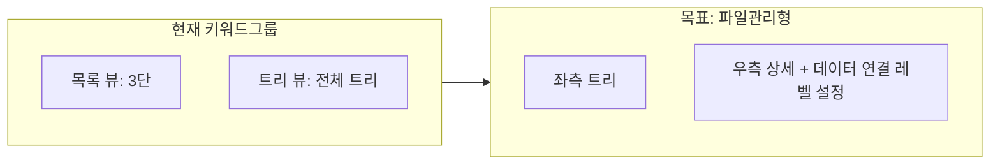

# 키워드 그룹 트리 → 파일 관리형 UI 변경 검토

> 작성일: 2026-02-18  
> 상태: 검토

키워드 그룹 페이지를 파일 관리(파일관리)와 동일한 **좌측 트리 + 우측 상세** 레이아웃으로 바꾸고, 우측 상세에 **데이터 연결 레벨 설정**을 두는 UI 변경 검토안.

---

## 1. 현재 구조 (AS-IS)

**키워드 그룹 페이지** (web/src/pages/admin/groups.html):

- **뷰 전환 탭**: "키워드 그룹 목록" | "키워드 그룹 트리" 두 가지 모드.
- **목록 뷰**: 3단 레이아웃 (`groups-three-col`) — 그룹 목록 | 그룹 상세 | 키워드 목록.
- **트리 뷰**: 전체 영역이 트리만 표시 (`groups-tree-container`), 브레드크럼 + 트리. 선택 시 하단 고정 바에서 "수정/삭제/선택 연결/선택 해제" 등 액션.

**파일 관리 페이지** (web/src/pages/admin/knowledge-files.html):

- **단일 레이아웃**: 좌측 트리 패널(`kf-tree-panel`, 260px) + 우측 콘텐츠(`kf-file-panel`). 탭은 우측만 전환(파일 목록 / 업로드·동기화).
- **우측 상세**: "탐색 깊이"(max_depth), "표시 개수"(limit) 등 **레벨/설정** UI가 우측 상단에 위치.

---

## 2. 변경 방향 (TO-BE)

### 2.1 레이아웃

- **목록/트리 탭 제거** → **항상 좌측 트리 + 우측 상세** 한 가지 레이아웃만 사용.
- **좌측 패널**: 파일 관리와 동일한 형태의 트리 (그룹 계층만 표시). 기존 keyword-group-treeview.js의 트리 렌더링·선택·드래그앤드롭 유지 또는 이식.
- **우측 패널**: 선택된 그룹의 **상세(이름, 수정/삭제)** + **키워드 목록** + **데이터 연결 레벨 설정** 영역.

### 2.2 우측 상세에 넣을 내용

| 영역 | 내용 |
|------|------|
| 그룹 상세 | 그룹명, 설명, 수정/삭제 버튼 (기존 2단 상세와 동일) |
| 키워드 목록 | 연결된 키워드 목록, 검색, 추가/제거 (기존 3단 키워드 영역과 동일) |
| **데이터 연결 레벨 설정** | 신규 또는 기존 파라미터 노출. 후보: (1) **트리 표시 깊이** (max_depth, 예: 1~10단계) — 현재 API `/api/labels/tree?max_depth=5` 존재. (2) **그룹별 연결 범위** (해당 그룹에 하위 몇 단계까지 키워드 연결할지 등) — 백엔드/비즈니스 정의 필요. |

"데이터 연결 레벨"의 **정의**가 제품/기획에 따라 다를 수 있음:

- **옵션 A**: 트리 **표시** 깊이만 (파일관리의 "탐색 깊이"와 유사) → 기존 `max_depth` 쿼리만 우측에 노출하면 됨.
- **옵션 B**: 그룹별 **연결 범위**(예: 이 그룹에 연결할 라벨의 깊이) → 백엔드에 그룹 메타 필드·API 추가 검토 필요.
- **옵션 C**: 둘 다 (트리 깊이 + 그룹별 연결 레벨) → 우측에 두 블록으로 배치.

구현 전에 **옵션 A/B/C 중 어떤 의미로 쓸지** 제품 측 확인이 필요함.

### 2.3 레이아웃 스펙 (파일관리 참고)

- admin-knowledge-files.css: `.kf-explorer { grid-template-columns: 260px 1fr; }`, `.kf-tree-panel`(좌), `.kf-file-panel`(우).
- 키워드 그룹은 **동일 그리드**를 쓰고, 클래스 접두사만 `kg-`(keyword-group) 등으로 분리해 파일관리와 혼선을 피하는 방안 권장.

---

## 3. 작업 범위 (검토 기준)

| 구분 | 항목 |
|------|------|
| HTML | groups.html: 탭 제거, 3단 div 제거. `kg-explorer`(좌 트리 + 우 상세) 한 블록으로 교체. 우측에 "데이터 연결 레벨 설정"용 마크업 추가. |
| CSS | admin-groups.css: 3단 스타일 정리, 파일관리형 grid(좌 260px + 우 1fr) 추가. 트리 패널·우측 패널 클래스는 `kg-` 계열로 통일. |
| JS | keyword-group-manager.js: 목록/트리 전환 제거, **트리 단일 진입**으로 초기화. keyword-group-treeview.js: 트리가 좌측 패널 한 영역에만 렌더되도록 바인딩 변경. keyword-group-ui.js: 우측 상세·키워드 목록·데이터 연결 레벨 설정 연동. |
| API | 트리 표시 깊이만 쓸 경우: 기존 `GET /api/labels/tree?max_depth=5` 유지, 프론트에서 max_depth를 우측 "데이터 연결 레벨"에서 선택한 값으로 넘기면 됨. 그룹별 연결 레벨을 도입할 경우: 라벨/그룹 스키마·API 확장 검토 필요. |

---

## 4. 리스크·선택 사항

- **목록 뷰 제거**: 현재 "키워드 그룹 목록"을 선호하는 사용자가 있으면, 제거 시 불편할 수 있음. 트리만 남기거나, **트리만** 두는 전제로 검토함.
- **데이터 연결 레벨**: 의미(트리 깊이 vs 그룹 연결 범위 vs 둘 다)를 먼저 정해야 우측 UI와 API 변경 범위가 확정됨.
- **하단 고정 바**: 현재 트리 뷰에서 선택 시 노출되는 하단 바(수정/삭제/선택 연결 등)는 **우측 상세 상단 또는 키워드 목록 위**로 옮기는 쪽이 파일관리형과 맞음.

---

## 5. 권장 순서

1. **제품/기획**: "데이터 연결 레벨"을 옵션 A/B/C 중 어떤 것으로 할지 결정.
2. **레이아웃 적용**: groups.html + admin-groups.css에서 파일관리형 좌 트리 + 우 상세로 전환, 탭 제거 및 트리 단일 진입.
3. **우측 블록**: 그룹 상세 + 키워드 목록 + 데이터 연결 레벨 설정(선택한 정의에 맞게) 배치 및 JS 연동.
4. **API**: 트리 깊이만 쓰면 기존 API 유지; 그룹별 연결 레벨 도입 시 백엔드 확장 후 연동.

이 순서로 진행하면 키워드 그룹 트리를 파일 관리와 같은 좌측 트리 + 우측 상세 구조로 맞추고, 우측에 데이터 연결 레벨 설정을 두는 방향으로 정리할 수 있음.
